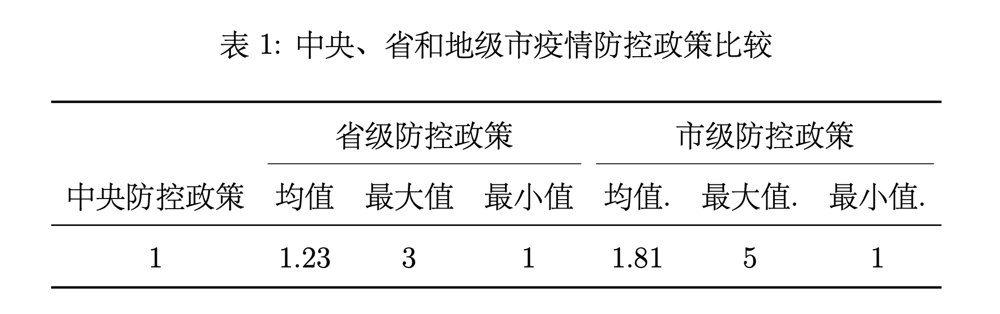
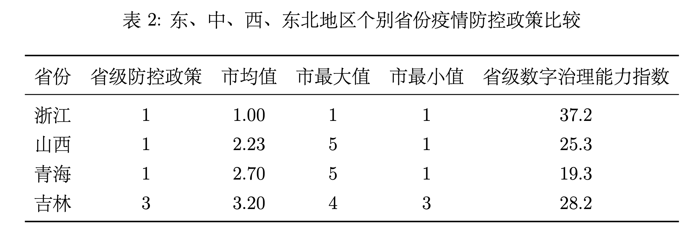

```{r setup, include = FALSE}
knitr::opts_chunk$set(echo = FALSE, message = FALSE, warning = FALSE, htmltools.dir.version = FALSE)
xaringanExtra::use_xaringan_extra(c("tile_view", # O
                                    "broadcast",
                                    "panelset",
                                    "tachyons"))
library(pacman)
# Functions preload
set.seed(19970921)
```


class: inverse, bottom

# Pressure System: A Perspective on Local State Capacity

???

Good afternoon dear professors and fellow students. My name is Sun Yufei. I am a PHD candidate from the Department of Political Science of Tsinghua University. It is my honor to have the opportunity to share my article collaborated with Prof. Yang. Our title is 'Capacity Space' of Local Governance and the Pressure System.

---

## Same Country, Different Travel Restriction Policy

.pull-left[

.center[]

"Henan: Return Home with Malicious Intent"

]

--

.pull-right[


"Shanghai: Nucleic Acid Test under Firework"

]

???

Let's start with a story of reunion. It is a Chinese tradition to return home for the new year.

In 2021, in my hometown, Henan province, I had a hard time in returning home for the New Year due to a series of travel restrictions, and some local officials even regarded our returning as a bad intent.

However, my Shanghai friends had a different story while returning to Shanghai, everything went smoothly, people were even doing the nucleic acid test under fireworks. It is even a bit romantic!

Why the unified policy from central government varies so much from place to place. This is our puzzle of this article.

---

## Intergovernmental Relations: Classic Theories and Challenges

- "Honeycomb" Structure (SHUE, 1990)

???

In recent years, as the important topic of local governance, researchers have discussed the impact of intergovernmental relations on local governance from the perspectives of different departments and levels.

There are "Honeycomb" Structure

--

- "M-type structure" (QIAN et al., 1993)

???

, "M-type structure"
--

- "Fiscal Federalism with Chinese Characteristics" (MONTINOLA et al., 1995)

???

"Fiscal Federalism with Chinese Characteristics"

--

- .navy[the Pressure System (Rong Jingben, 1998) ]

???

and other explanations such as Pressure System.


--

  - vivid description
  
???

Among them, the "Pressure System", as a theoretical description of the Chinese local governance practice, has received a lot of discussions from scholars. It not only vividly describes the pressure and the motivation in Chinese local governance.
  
--

  
  - Overall Integration
  
    - "Target-Responsibility System" (EDIN, 2003)
    
    - "Project System" (Chen Jiajian, 2013)
    
    - "Administrative Subcontracting System" (Zhou Li'an, 2014)

???

Also, it can better integrate other concepts such as "Target-Responsibility System" [@Edin2003], "Project System" [@ChenJiaJian2013], "Administrative Subcontracting System" [@ZhouLiAn2014] ).

---

## Characteristics, Contributions and New Changes of "Pressure System"

--

- Core: .red["Pressure Coefficient"]

???

The core of the "pressure system" is the "pressure coefficient", which is adjusted by the central government. Which means, the autonomy space of the local government is controlled by the superior government.

--

.navy["Three Elements"]:

- Quantitative task decomposition mechanism

- Problem solving mechanism with joint participation of all departments

- Materialized multi-level evaluation system

???

"Pressure System" includes "Three Elements", "Four Sources" and "Two Pressure relief valves".
The "three elements" are Quantitative task decomposition mechanism, Problem solving mechanism with joint participation of all departments, and the materialized multi-level evaluation system.

--

.navy["Four sources":

Superiors, peers, the general public and the market


???

"Four sources" means that local governments face pressure from: superiors, peers, the general public and the market.

---

## Characteristics, Contributions and New Changes of "Pressure System"

.navy["Two pressure relief valves":]

- .red["relationship"]&.red[statistics]

???

"Two pressure relief valves" are "relationship" and "statistics". "Relationship" means that superior governments and local governments use informal way such as personal relationships to conduct games and set goals. "Statistics" means that the superior governments can adjust the "pressure coefficient" of the local government through adjusting the statistical method.


---

## .red [new changes] of intergovernmental relations since the 18th National Congress of the Communist Party of China:


- Re-centralization of supreme power (GUO, 2020)

???

Since the 18th National Congress of the Communist Party of China, the central government have initiated a series of major political system changes, and scholars have described the influence of changing political atmosphere on Chinese local governance from the perspectives of

re-centralization of supreme power [@Guo2020]

--

- Redistribution of Executive Power (Feng Shizheng, 2014)

???

Redistribution of Executive Power [@FengShiZheng2014]

--

- The Weakening of Local Autonomy (Jing Yuejin, 2018)

???

The Weakening of Local Autonomy [@JingYueJin2018]

--


- "Strong supervision, weak incentives, and hard indicators" (Li Zhen et al., 2020)

???

"Strong supervision, weak incentives, and hard indicators".

---

## Changes in Operating Environment 

Quantitative task decomposition mechanism:

- Administrative discretion .navy[↓] (Feng Shizheng, 2014)

The problem-solving mechanism with the joint participation of all departments:

- The inspection and acceptance power of the central government  .navy[↑]

Multi-level evaluation system:
- The collection of economic rights, taxation rights and investment promotion rights, as well as the fixation of personnel compensation.navy[↓] (Li Zhen et al., 2020; Huang Xiaochun, 2017)

## Pressure change

Pure economic growth.navy[→]Governance competition with diversified goals. (Peng Bo et al., 2019)


???

The reduction of the administrative discretion of the local government, the increase of the inspection and acceptance power of the central government, and the change of the multi-level evaluation system have profoundly changed the operating environment of the pressure system.

The original pressure of pure economic growth has also evolved into a governance competition with diversified goals [@PengBoZhaoJi2019];


---

## "Dysfunction of the pressure relief valves?"

.center[Reforms in the areas such as vertical management system, budget disclosure and wages transparency]

???

The biggest impact of the political reform on the pressure system lies in the dysfunction of the two main pressure relief valves. Reforms in the areas such as vertical management system, budget disclosure and wages transparency


--

.center[$$\downarrow$$]

--

.center["relationship" ❌]

???

It increasingly narrows the running space of informal system like "relationship", which is a pressure relief valve;

--

in addition,

.center[Control of statistical power + extension of digital management to local administration]

???

The control of statistical power and the extension of digital management to local administration [@WangYuLei2016]

--

.center[$$\downarrow$$]

--

.center["statistics" ❌]


???
makes it become more and more difficult for the pressure relief valve "Statistics" to function.


---

## "Dysfunction of the pressure relief valves?"

.center[Blow up 💥? Complete consistency? 👮️]

.pull-left[

.center[]

]


.pull-right[


]

???

Without a pressure relief valve, the pressure system will either blow up or the policies will be completely consistent across the country. Is this the reality?

---

## Same country, different epidemic prevention ways

.pull-left[

.center[]

"Epidemic prevention slogan"

]

.pull-right[


Shanghai: nucleic acid test under fireworks

]

???

We found that under a similar pressure process, although most local governments increased pressure to respond to the pressure from their superiors, and ensure the realization of policy goals, not all local governments adopted the same strategy of increasing pressure.

Taking the current "travel restriction policy" as an example, in the face of the same policy goals and pressure from superiors, some places adopted a one-size-fits-all policy, maximizing the travel restriction, and striving to obtain the greatest prevention effect at the shortest time, lowest level, and least cost.

This heterogeneity proves to a certain extent that local governments still have a certain degree of autonomy in the environment of "strong supervision, weak incentives and hard indicators"; the "pressure relief valve" is actively applied by the local governments.


--


.center[.red[Heterogeneity of incremental policies]]

--

.center[.red[What is the new pressure relief valve? ]]

???

Then why does this pressure relief valve exist?


---

class: inverse, bottom

# "Capacity Space"

---

## New IV: "Capacity Space"

.center[]


???

State capacity is a premise for state autonomy, and the capacity of local governments also allows them to retain some space for autonomy despite pressure from multiple parties


---

class: inverse, bottom

# Empirical test: the travel restriction policies in various places during the Chinese New Year of 2021 as an example

---

## research questions

RQ1: Have local governments at different levels and regions in China been affected by the "pressure system" in their travel restriction policies during the Chinese New Year of 2021? Was there a phenomenon of "incremental policies"?

RQ2: If this "incremental policies" phenomenon based on the pressure system was common, was there any heterogeneity in the incremental strategies of different local governments? What factors influenced the extent of increment in policies?

???

We test the capacity space by analyzing the differential formulation of travel restriction policies across China during the Chinese New Year of 2021.

Specifically, this paper attempts to answer two research questions: First, Have local governments at different levels and regions in China been affected by the "pressure system" in their travel restriction policies during the Chinese New Year of 2021? Was there a phenomenon of "incremental policies"? 

"incremental policies" means the policy become more and more strict from the top government to the local.

Further, if this phenomenon was common, was there any heterogeneity in the incremental strategies of different local governments? What factors influenced the extent of increment in the policies?

To find out the answers, we first used natural language processing methods to encode the travel restriction policy texts of 293 prefecture-level cities in China during the Chinese New Year of 2021, investigating the phenomenon of "incremental policies" in governments at all levels; Then we conducted a regression analysis to identify and test the influencing variables and pressure sources.

---

## Data selection principles

- Clear central mission

- Evident pressure transfer

- charming .navy[heterogeneity]

???


We chose this case because:

**First, the central mission was clear. **
Under the unified arrangement of the central government, the policy objectives of various regions were rather clear. The entire social and economic system operated around the command of local travel restriction policy. The party and government departments are not only commanders, but also organizers and fighters;

**Second, the pressure transfer was evident. **
After the State Council issued the policy, the administrative departments from the central government to the provinces, the prefecture-level cities, and the grass-roots villages (communities) have issued the detailed implementation rules;

More importantly, although they are under the same pressure, and they all use "incremental strategies" to transfer pressure, the incremental policies have shared great heterogeneity among different local governments. This differential performance of policy diffusion has provided us with an excellent opportunity to measure the pressure system.

---

## Research hypotheses

H1: There was a phenomenon of "incremental policies" in the travel restriction policies made by local governments at different levels and regions in China during the Chinese New Year of 2021;


H2: The governance capacity of local governments affected the extent of increment in the policies ;

- H2.1: The higher the digital governance capacity with local governments, the less the extent of increment in the policies;

- H2.2: The higher the medical capacity with the local governments, the less the extent of increment in the policies. 


???

Our first hypothesis is that "incremental policies" were common across the country and at all levels of governments.


H2: The governance capacity of local governments affected the extent of increment in the policies ;

---

## Data sources and variable settings

.pull-left[

Dependent variable: the extent of increment in travel restriction policies during the Chinese New Year of 2021

From .red[low risk areas] to .red[people in urban areas]

Web crawler + natural language processing + multiple manual verification

- "Conditional Free Mobility" (1)

- "Health Reporting" (2)

- "Nucleic Acid Test" (3)

- "Health Monitoring" (4)

- "Home Health Monitoring" (5)

- "Home Quarantine" (6)

]


???

The dependent variable in this study is the extent of increment in the policies.

We would like to emphasize that we only focus on local travel restrictions for people from **low-risk areas** who travel to **urban areas**. We chose the low-risk areas was because all sectors of society held a quite consistent opinion on the control of people from **medium and high risk areas**, where strict measures were adopted to contain the epidemic; **urban areas** was selected because the central government had already clearly made travrl res for the returning to rural areas.

First, we used web crawlers to obtain the travel restriction policies texts of 293 prefecture-level cities across the country during the Chinese New Year of 2021 from data sources such as government websites, government official accounts, and government service platforms.

For the above policy texts, we combined machine coding and manual verification to encode them. We first used regular expression to identify the key words of the policy text for preliminary classification; secondly, three trained research coders of our team reviewed and verified the original text, spotting the fuzzy and disputed classifications one by one to finally reach consistent classification results. Through machine coding and manual verification, we divided the target policies into six types: "conditional free mobility" (1), "health reporting" (2), "nucleic acid test" (3), "health monitoring" (4), "Home Health Monitoring"  (5) and “Home Quarantine” (6).

--

.pull-right[

- Local governance capacity

  - Digital governance capacity (Research Report on the Development of China's Digital Government (2021))
  
  - Medical capacity
    
- Superior government pressure
  
  - Number of confirmed cases in the province last month

- Peer government pressure

  - The number of confirmed cases in cities at the same level last month
  
- Public pressure

  - Baidu Index

]

???

Our core independent variable is the local governance capacity. We used the "Research Report on the Development of China's Digital Government" published by the Data Governance Center of Tsinghua University in 2021 as the evaluation index of the local governments' digital governance capacity. In terms of their medical capacity, we chose the number of hospital beds in the prefecture-level cities.

Meanwhile, we also tested variables such as the superior government, peer government, and the public. We used the number of confirmed cases of the province where the prefecture-level city is located , in the month before the policy release (which was December 2020) as a proxy variable for superior government pressure.

In terms of peer governments, we believe that the pressure on local governments come, not only from peer governments in the same region, but also from peer governments with similar levels of development. Therefore, we divided the peer government pressure into two cases. If the prefecture-level city is a sub-provincial city or a provincial capital city, we used the number of confirmed cases of the cities at the same level; otherwise, if the prefecture-level city is a general city, we used the number of confirmed cases in other cities within the same province. To measure the public pressure, we use the month-on-month growth of the Baidu search index under the keyword "epidemic" in December 2020 as a proxy variable.


---

## The phenomenon of "Incremental Policies" between local governments at different levels and regions




???

From the table below, we can see that the travrl res proposed by provincial governments were more strict than those proposed by the central government, and the strictness of city governments was higher than that of provincial governments. Policies were becoming more and more strict to the grassroots level. It shows a trend of "increment". 

Specifically, Jilin Province had the most policy increment at the provincial level, requiring all those returning to (or coming to) Jilin from "non-medium or high-risk areas" to hold a negative nucleic acid test certificate obtained within 3 days before arrival. The most policy increment found at the city level was represented by Dezhou, Shandong. These local governments required people returning from low-risk areas to undergo 14-day health monitoring at home.

---

## regional difference



.center[.red[There is a phenomenon of “incremental policies” in the travel restriction policies of local governments at different levels and regions in China during the Chinese New Year of 2021. In terms of level, the prefecture-level city governments incremented polices the most, and in space, weak digital governance areas incremented policies the most. ]]

???

We selected one province each in East, Central, West, and Northeast to compare their increment differences in detail.

We found that in terms of spatial distribution, the pressure system remained a national system, and the increment situation of travel res policies was common in the central, western and northeastern regions except for Zhejiang Province. And there was obvious heterogeneity in space.


---

## "Capacity Space": Empirical Evidence of Government Capacity and the Extent of Policy Increment 

.center[]

???

What factors contributed to this heterogeneity? We found that the four sources of pressure in the classical theory still have strong explanatory power. Local pressure, peer government pressure, superior government pressure, and public pressure still have a significant impact on the extent of increment of local travel restriction policies.

On this basis, we tested the influence of the local governments' governance capacity, and we found that the local governments' digital governance capacity and medical capacity have a significant impact on the degree of local government's travel restriction policies: under the premise of controlling for other variables, the stronger the digital governance capacity with the local governments, the less the extent of increment in the travel restriction policy; likewise,  the stronger the medical capacity, the less the extent of increment in the policy. In other words, governance capacity is a pressure relief valve for local governments to face pressure from all parties. The stronger the governance capacity, the greater the administrative autonomy of the local government, that is, the greater the "capacity space", so it can more flexibly handle the pressure from multiple parties and policy increment.

After standardizing the variables, we can compare the degree of influence of different independent variables on the dependent variable. Through the comparison of the figure on the right, we found that the local medical capacity has the greatest impact on all independent variables; the local digital governance capacity also has a greater impact on the extent of increment of the local governments' travel restrictions.


---

## Summary and discussion

- The pressure system still works

- "Capacity Space": The "Relief Valve" Effect of Local Government Governance Capacity on the Operation of "Pressure System"

???

This study takes the differential formulation of travel restriction policies in various parts of China during the Chinese New Year in 2021 as an example, examining that after the reform of the political system at the 18th National Congress of the Communist Party of China, the "pressure system" remains a strong explanation for the practice of Chinese local governance. It also discovered the "pressure relief valve" effect of local governance capacity on the pressure system, and put forward the point of "capacity space", providing theoretical revision of the "pressure system" in the new era.

However, this paper also has some deficiencies: first, due to data limitation, we did not analyze county-level governments, which are included in the original theory. There are enough data to carry out an empirical test; In addition, the specific impact mechanism of local government governance capacity on local autonomy under the pressure system needs to be further examined in future research.

That's my sharing. Thank you so much for your attention and please feel free to ask questions or comment.

---
class: inverse, center, middle


# Crab Crab 🦀️

[Mails: sunyf20@mails.tsinghua.edu.cn](mailto: sunyf20@mails.tsinghua.edu.cn)

[Website: syfyufei](https://syfyufei.github.io/)

[Github: github.com/syfyufei](https://github.com/syfyufei)