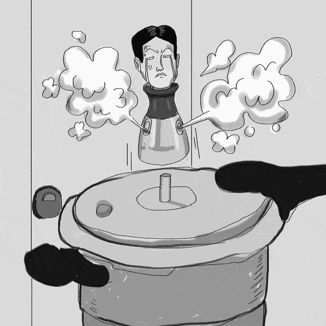
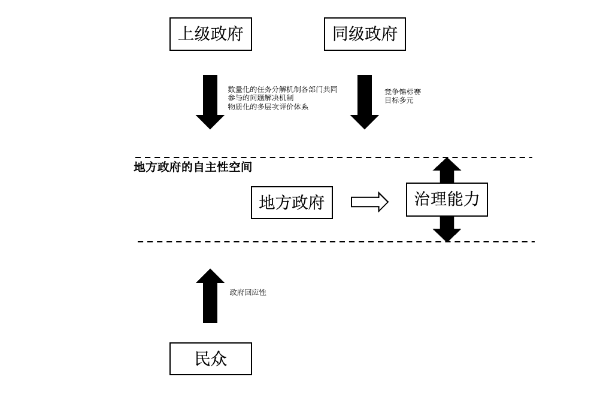
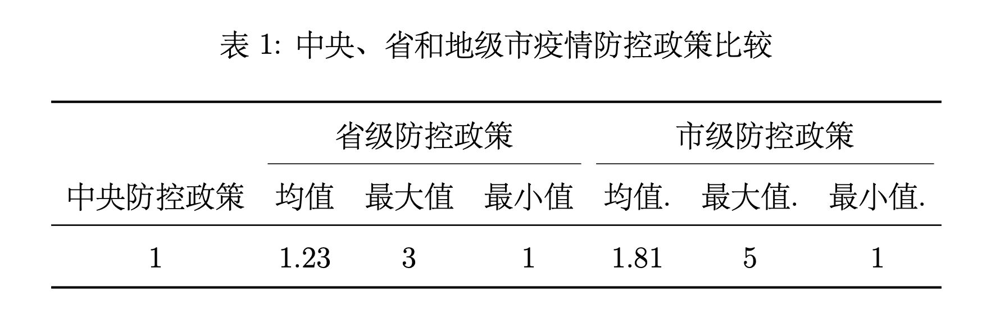
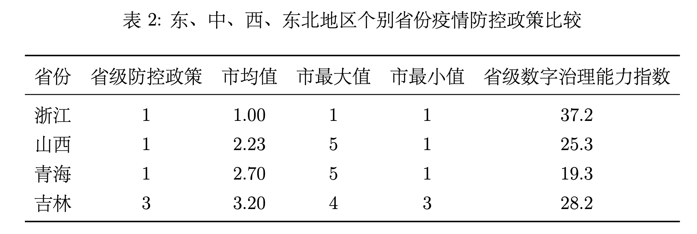
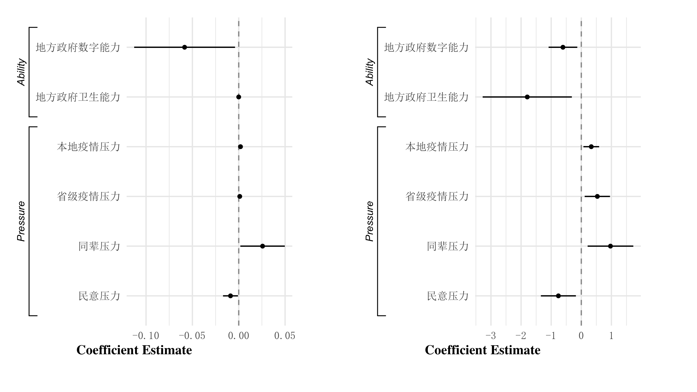

```{r setup, include = FALSE}
knitr::opts_chunk$set(echo = FALSE, message = FALSE, warning = FALSE, htmltools.dir.version = FALSE)
xaringanExtra::use_xaringan_extra(c("tile_view", # O
                                    "broadcast", 
                                    "panelset",
                                    "tachyons"))
library(pacman)
# Functions preload
set.seed(19970921)
```


class: inverse, bottom

# 压力型体制：一个地方国家能力的视角

???

尊敬的老师，同学们大家下午好，我是来自清华大学政治学系的博士生孙宇飞，非常荣幸有机会向大家汇报我和杨雪冬老师一起合作的文章“能力不够压力来凑：治理能力与压力型体制”。


---

## 政府间关系：经典理论与挑战

- "蜂巢式结构" (SHUE, 1990)

???

近年来，作为地方治理的核心环节,研究者从不同部门、不同层级出发，讨论了政府间关系对于地方政府行为和治理模式的影响。学者们"蜂巢式结构"

--

- "M型结构" (QIAN 等, 1993)

???

、"M型结构"
--

- "中国特色的财政联邦主义"  (MONTINOLA 等, 1995)

???

"中国特色的财政联邦主义" 

--

- .navy[压力型体制 (荣敬本, 1998) ]

???

和压力型体制等解释。


--

  - 生动描述
  
???

其中，“压力型体制”作为对中国地方治理实践的理论描绘，得到了国内外学者的广泛关注和讨论。 [@YangXueDong2012]它不仅生动的描述了中国地方治理的压力和动力
  
--

  
  - 全局整合
  
    - “目标责任制” (EDIN, 2003)
    
    - “项目制” (陈家建, 2013)
    
    - “行政发包制” (周黎安, 2014a)

???

还由于其理论的全局性，能够对其他富有解释力的概念（诸如“目标责任制” [@Edin2003] 、“项目制” [@ChenJiaJian2013] 、“行政发包制” [@ZhouLiAn2014] ）进行较好地整合。

---

## “压力型体制”的特征、贡献及其新变化

--

- 核心：.red[“压力系数”]

???

“压力型体制”的核心在于“压力系数”，即地方政府的自主性空间由上级政府决定，中央政府能够通过“压力系数”的调节来动态调整地方治理的自主性空间。


--

.navy[“三要素”]:

- 数量化的任务分解机制

- 各部门共同参与的问题解决机制

- 物质化的多层次评价体系

???

它的运行包括“三要素”、“四来源”和“两减压”三个主要部分。
“三要素”是指数量化的任务分解机制、各部门共同参与的问题解决机制和物质化的多层次评价体系。

--

.navy["“四来源”"]:

上级、同级、民众和市场


???

“四来源”是指地方政府面临着包括上级、同级、民众和市场四个方面的压力。
---

## “压力型体制”的特征、贡献及其新变化

.navy[“两减压”:]

- .red[“关系”]&.red[统计]

???

“两减压”是指“关系”和“统计”这两大压力型体制的减压阀。“关系”是指上下级会借助私人关系等非正式制度来进行博弈和设定目标。“统计”是指上级会通过调整统计方法和口径来调节下级的“压力参数”。


---

## 十八大以来政府间关系的.red[新变化]:


- 最高权力的重新集中 (GUO, 2020)

???

自十八大以来，党和政府推动了一系列重大的政治体制变革，学者们从最高权力的重新集中 [@Guo2020]

--

- 行政权的重新分配  (冯仕政, 2014)

???

行政权的重新分配 [@FengShiZheng2014]

--

- 地方自主性的削弱 (景跃进, 2018)

???

地方自主性的削弱 [@JingYueJin2018]

--


- “强监督、弱激励、硬指标”  (李振等, 2020) 

???

“强监督、弱激励、硬指标”等角度形象的描绘了十八大以来政治氛围上的变革对中国地方治理的影响

---

## 运行环境改变

数量化的任务分解机制：

- 行政自由裁量权 .navy[↓] (冯仕政, 2014)

各部门共同参与的问题解决机制:

- 中央政府检查验收权 .navy[↑]

多层次评价体系:
- 经济权、税收和招商引资权的上收以及人员报酬的固定化.navy[↓] (李振等, 2020; 黄晓春, 2017) 

## 压力改变

单纯经济增长.navy[→]目标多元化的治理竞赛。(彭勃等, 2019)


???

地方政府行政自由裁量权的减少，中央政府检查验收权上升，多层次评价体系的变化，深刻改变了压力型体制的运行环境。

原本单纯经济增长的压力也演化为目标多元化的治理竞赛 [@PengBoZhaoJi2019];


---

## "减压阀的失灵？"

.center[系统垂直化管理、预算公开和阳光工资等领域的改革]

???

政治体制改革对于压力型体制最大的影响在于两个主要减压阀的失灵。系统垂直化管理、预算公开和阳光工资等领域的改革


--

.center[$$\downarrow$$]

--

.center[“关系” ❌]

???

使得“关系”等非正式制度减压阀的作用空间越来越少；

--

.center[统计权的控制 + 数字管理的下沉]

???

统计权的控制、数字管理的下沉 [@WangYuLei2016]

--

.center[$$\downarrow$$]

--

.center[“统计” ❌]


???
使得统计这个减压阀对压力越来越难发挥调节作用。


---

## "减压阀的失灵？"

.center[炸掉💥？完全一致？👮️]

.pull-left[

.center[]

]


.pull-right[




]

???

缺少减压阀，压力型体制要么炸掉要么各地政策完全一致，那现实情况是这样么？

---

## 同一个国家，不同的防疫

.pull-left[

.center[]

"防疫标语"

]

.pull-right[


上海：烟花下的核酸检测

]

???

我们发现，在相似的压力过程下，虽然大多地方政府都加码加压来回应上级压力，确保政策目标的实现，但并非所有的地方政府都采取一样的加码策略。

以当前“疫情防控”为例，面对同样的政策目标和上级压力，有些地方采用一刀切的政策，对疫情防控各项规定顶格制定、顶格执行；有些地方则采用精准疫调的方式，努力最早时间、最低层级、最小成本获得最大防控成效。

这种异质性一定程度上证明了地方政府在“强监督、弱激励和硬指标”的环境下仍然具有一定的自主性空间；而自主性空间的异质性又一定程度上表明，这一“减压阀”由地方政府能动的控制。


--


.center[.red[层层加码：红🐎还是绿🐎？]]

--

.center[.red[何以存在减压阀？]]

???

那这种减压阀何以存在鸭？


---

class: inverse, bottom

# 政策扩散与“能力空间”

---


## 政策扩散与“能力空间”


“政策扩散”(Political Diffusion):

- 内部参与者 (DOLOWITZ 等, 1996)

  - 偏好 (HUBER 等, 2002; SHIPAN 等, 2006)
  
  - 目标 (GROSSBACK 等, 2004)
  
  - .red[能力] (HUBER 等, 2002)


???

我们基于政策扩散的经典研究，提出假设


---

## 政策扩散与“能力空间”

.center[]


???


我们认为和之前的“压力系数”并不相同，当前的这种自主性不是来源于上级政府，而是地方政府能动的结果。具体来说，这种新的减压阀来自于地方政府的治理能力。这使得他们在多方压力下还能保留一定的自主性空间，而这一自主性空间的大小是由其治理能力强弱决定的。我们将这种由能力取得的自主性空间称之为“能力空间”。

---

class: inverse, bottom

# 实证检验：以2021年春节期间各地的疫情防控政策为例

---

## 研究问题

RQ1：中国不同层级和地域的地方政府在2021年春节期间疫情防控政策上是否都受到“压力型体制”的影响？具体表现为是否存在“层层加码”的现象

RQ2：如果这种基于“压力型体制”的层层加码现象是普遍的，不同地方政府的加码策略是否存在异质性？哪些因素影响着他们的政策加码程度？

???

我们通过对2021年春节期间疫情防控政策在中国各地的差异化制定的分析，来检验上述假设

具体来说，本文尝试回答两个研究问题：首先，虽然社会对春节疫情防控“层层加码”、“一刀切”的现象批评众多，但中国不同层级和地域的地方政府在2021年春节期间疫情防控政策上是否都受到“压力型体制”的影响？具体表现为是否存在“层层加码”的现象。进一步的，如果这种现象是普遍的，那不同地方政府的加码策略是否存在异质性？哪些因素影响着他们的政策加码程度？

具体来说，我们首先使用自然语言处理等方法对中国293个地级市2021年春节期间的疫情防控政策文本进行编码，考察各地各层级政府的“层层加码”现象；之后借助回归分析对影响变量和压力来源进行识别和检验。


---

## 数据选取原则

- 中心任务明确

- 压力传输明显

- 迷人的.navy[异质性]

???


我们选取这个案例是因为：

**首先，中心任务明确。**
在中央政府的统一安排下，各地的政策目标十分明确，整个社会经济系统围绕当地疫情防控的指挥棒运行，党政部门是既是指挥员，又是组织员和作战员；

**其次，压力传输明显。**
在国务院发布政策后，从中央到省再到地级市直至基层村（社区）行政管理部门都发布了执行细则；

更为重要的是，虽然受到的压力相同，也都使用加码来传输压力，但加码方式在不同地方政府间存在较大的**异质性**。这种政策扩散的差异性表现给我们衡量“压力型体制”提供了绝佳的机会窗口。

---

## 研究假设

**H1:中国不同层级和地域的地方政府在2021年春节期间疫情防控政策上存在“层层加码”的现象；**


**H2: 地方政府的治理能力影响着当地的政策加码程度；**

- **H2.1: 地方政府的数字治理能力越高，当地的政策加码程度越小；**

- **H2.2: 地方政府的医疗能力越高，当地的政策加码程度越小。**


???

我们的第一个假设是，层层加码在全国和各层级普遍存在


---

## 数据来源和变量设置

.pull-left[

因变量：2021年春节期间疫情防控政策的加码程度

来自.red[低风险地区]前往.red[城市地区人群]

网络爬虫 + 自然语言处理 + 多人工核实

- “有条件自由流动”（1）

- “健康报备”（2）

- “核酸检测”（3）

- “健康监测”（4）

- “居家健康监测”（5）

- “居家隔离”（6）

]


???

本研究的因变量是加码程度，

需要强调的是，我们只关注各地针对来自**低风险地区**前往**城市地区**人群的疫情管控政策。选择低风险地区是因为社会各界对来自**中高风险**人员的管制意见较为一致，均采用严格的措施围堵疫情；选择**城市地区**是因为中央政府明确规定了返回农村地区的防控政策。

首先，我们借助网络爬虫从政府网站、政府公众号和政务服务平台等数据源获取了全国293个地级市2021年春节期间的疫情防控政策。

对于上述政策文本，我们使用机器编码和人工查核相结合的方式对目标政策进行编码处理。我们首先使用正则表达式对政策文本的关键词进行识别从而进行初步分类；其次，研究团队的三位编码员在经过培训后对原始文本进行查核，对模糊和争议分类进行逐个确定，最终形成一致的分类结果。通过机器编码和人工查核，我们将目标政策分为“有条件自由流动”（1）、“健康报备”（2）、“核酸检测”（3）、“健康监测”（4）、“居家健康监测”（5）和“居家隔离”（6）六种类型。

--

.pull-right[

- 地方治理能力

  - 数字政府治理能力(《中国数字政府发展研究报告(2021)》)
  
  - 医疗能力
    
- 上级政府压力
  
  - 该省上月确诊人数

- 同级政府压力

  - 同级别城市上月确诊人数
  
- 民众压力

  - 百度指数

]

???

我们的核心自变量是地方的治理能力，我们使用清华大学数据治理中心2021年发布的《中国数字政府发展研究报告》作为地方政府数字治理能力的评估指数。在地方政府的医疗量能上我们使用的是该地级市的医院床位数。

与此同时，我们还考察了上级政府、同级政府和民众等变量。我们使用地级市所在省份政策颁布前一个月（2020年12月）的确诊数量作为上级政府压力的代理变量。

在同级政府方面，我们认为地方政府受到的压力不仅来自相同区域的同级政府，还来自发展程度更加相似的同级地方政府。因此，我们将同级政府的压力分成两种情况，如果该地级市是副省级城市或省会城市，我们使用同等级城市的确诊数量；如果该地级市是一般的城市，我们使用同省的其他城市的确诊人数，。我么嗯使用关键词“疫情”的百度搜索指数在2020年12月的环比增长作为民众压力的代理变量。


---

## 不同层级、不同区域地方政府间的“层层加码”现象




???

从下表中我们很容易看到，省级政府提出防控政策的严格程度平均说来都超过了中央提出的防疫政策，市级政府的严格程度超过了省级政府，即从中央到地级市层级，2021年春节期间的防疫政策呈现出越向基层越严格的“层层加码”态势。

具体来说，省一级加码最多的是吉林省，要求所有“非中高风险地区返（来）吉人员须持3日内核酸检测阴性证明。市一级加码最多的是以山东德州为代表的地级市，这些地方政府要求从低风险地区返回的民众，进行14天居家健康监测。

---

## 地域差异



.center[.red[中国不同层级和地域的地方政府在2021年春节期间疫情防控政策上存在“层层加码”的现象，在层级上，地级市政府加码最多，在空间上，数字治理能力弱的地区加码最多。]]

???

我们在东、中、西和东北部各选取了一个省来详细比较他们的加码差异。

我们发现在空间分布上，压力型体制仍旧是一个全国性的体制，防疫政策加码的情况在除浙江省外的中、西和东北广泛存在。而且在空间存在明显的异质性。


---

## “能力空间”：政府能力与加码程度的经验证据

.center[]

???

那哪些因素造成了这种异质性呢？我们发现，经典理论中的四个压力来源仍有较强的解释力，本地疫情压力、同级政府压力、上级政府压力和民众压力对地方政府疫情防控政策的加码程度仍有显著影响。

在此基础上，我们识别和检验了地方政府的治理能力的影响，我们发现地方政府的数字治理能力和医疗能力对地方政府疫情防控政策加码程度有显著的影响：在控制其他变量的前提下，地方政府的数字治理能力越强，疫情防控政策加码的越少；卫生能力越强，政策加码也就越少。即，治理能力是地方政府面对各方压力的减压阀，治理能力越强的地方政府的行政自主性即“能力空间”就越大，从而能够较为灵活的处理多方压力和政策加码。

在对变量进行标准化处理后，我们可以比较不同自变量对因变量的影响程度。通过上右图的比较，我们发现，地方的医疗量能在所有自变量中影响最大；地方的数字治理能力对地方政府疫情防控政策的加码程度也有较大影响。


---

## 总结与讨论

- 压力型体制仍有效

- “能力空间”：地方政府治理能力对“压力型体制”运行的“减压阀”效应

???

本研究以以2021年春节期间疫情防控政策在中国各地的差异化制定为案例，检验了在十八大政治体制变革后，“压力型体制”对中国地方治理的实践仍然有较强的解释力；还发现了地方政府治理能力对“压力型体制”运行的“减压阀”效应，提出了“能力空间”的观点，对“压力型体制”在新时代进行了理论修正与检验。

需要说明的是，本文也存在明显的不足：首先，由于数据的限制，我们仅对加码行为进行了“中央-省-地级市”层面的分析，而对原有理论中的县级政府没有足够的数据来进行实证检验；其次，地方政府治理能力对压力型体制下地方自主性的具体影响机制还有待后续研究进一步完善。

我的报告就到这里，请大家批评指教。

---
class: inverse, center, middle


# 蟹蟹 🦀️

[Mails: sunyf20@mails.tsinghua.edu.cn](mailto:sunyf20@mails.tsinghua.edu.cn) 

[Website: syfyufei](https://syfyufei.github.io/)

[Github: github.com/syfyufei](https://github.com/syfyufei)
