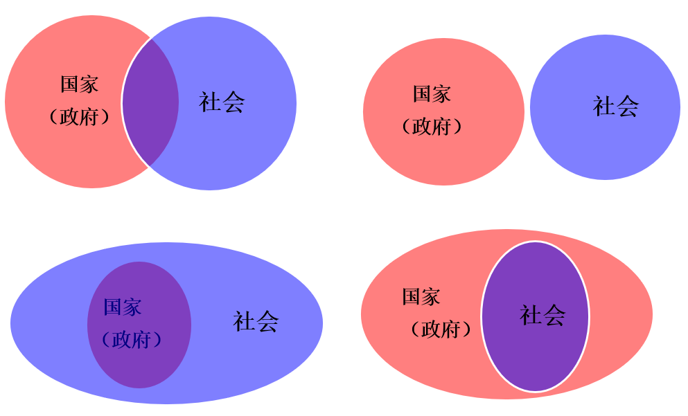
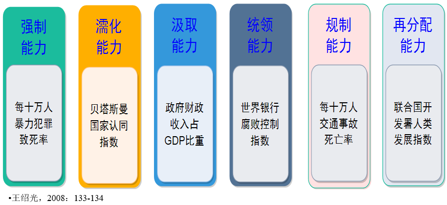
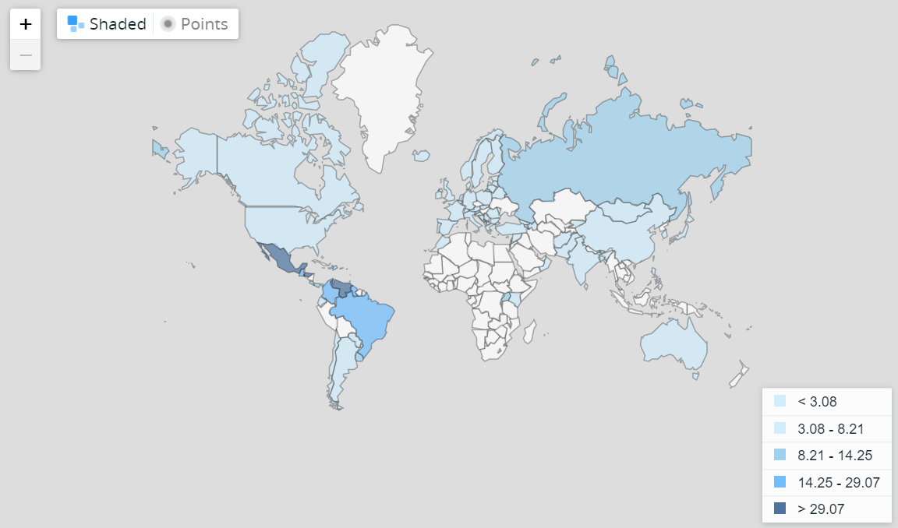
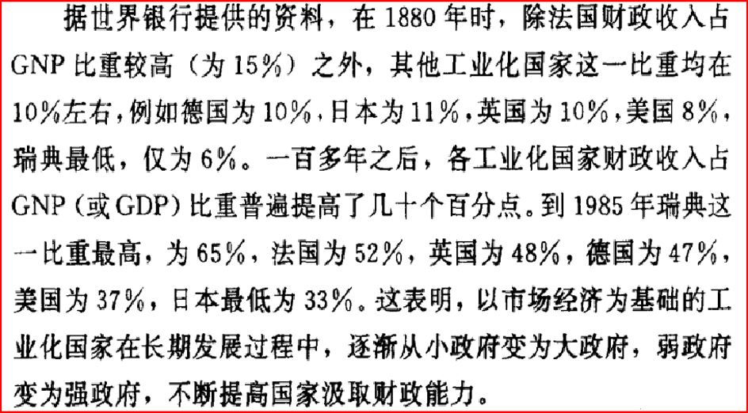
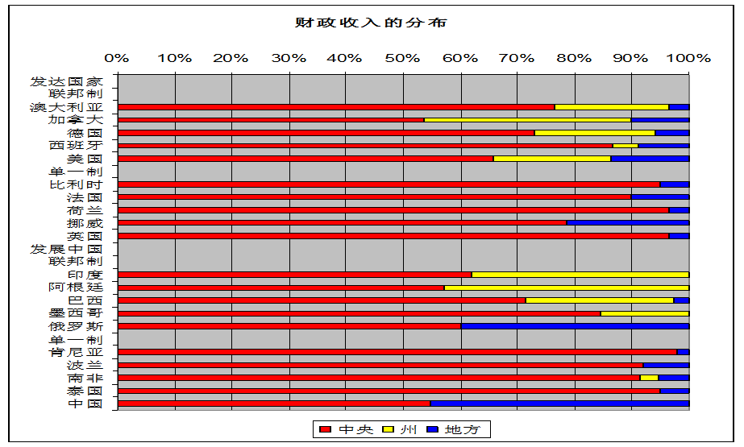
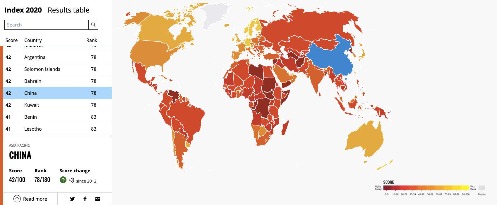
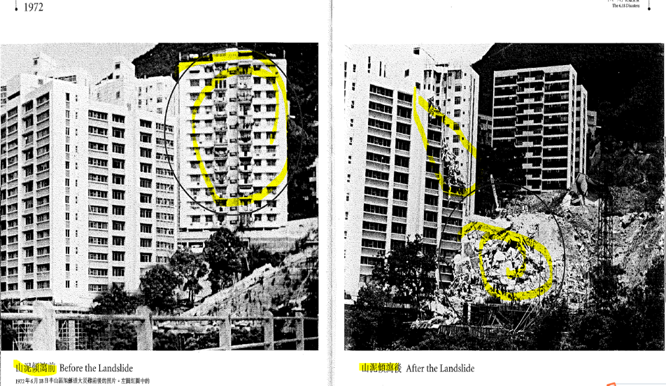
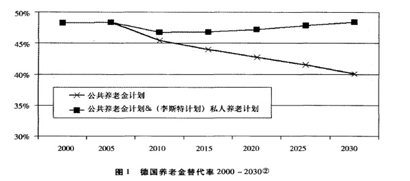

## Outline

- 国家及国家能力的界定

- 国家能力的发展过程

- 国家能力的分类

- 国家能力的测量

---
class: inverse, center, middle

# “国家”是什么？

---

## 国家是什么？：从证件看我们身边的国家

- 身份类：身份证、户籍证明、居住证、暂住证、特区通行证、学生证（小、中、大学）、士兵证、士官证、军官证、港澳通行证、护照；

- 教育类：毕业证（小、中、大学）、学位证（本硕博）、四六级英语证书、计算机等级证书（国家级、省级）、公共英语等级证书、获奖证书；

- 社会保障类：社保卡、低收入证明、医保卡、残疾证明；

- 个人生活类：结婚证、离婚证、驾驶证、健康证明、征信报告、独生子女证；

- 职业类：工作证、教师证、教师资格证、执业医师资格证、律师证、执法证；

- 经营类：工商执照、卫生许可证、营运证、纳税证明；

- 财产类：房产证、宅基地证、存款证明、车牌（机动车和非机动车）。

---

## 国家（State）：定义及构成要素

- .red[定义]：国家是一系列的.navy[组织机构]，具有能够做出对人民具有约束力的决定的.navy[权威]，并在法律上存在于某一特定的.navy[疆域]内，在必要的时候可以动用.navy[暴力]来推行其决定。（鲁施迈耶，埃文斯，2009：63）

- .red[特征]：
  - 一套法律体系和强制工具，用以创立和执行产权制度；
  - 一套法律和道德体系用以管制国家内部人们之间的互动；
  - 一种机制用以与其它国家进行贸易、抵御攻击等；
  - 一套程序和机构用以税收和控制人口（Levi, 2002: 40）

- .red[构成要素]：行动者、组织、制度

---

## State, Nation & Country

- .red[State]:
政治学涵义上的国家，是在既定领土范围内制定和执行规则的.navy[组织]。

- .red[Nation]:
特指那些建基于对.navy[共同文化、历史和命运的]接受，而不考虑成员之间政治的、社会的和经济的区别的国家（State）

- .red[Country]:
特指在地理位置或领土意义上的国家。

---

## 现代国家的定义

国家是一个.red[时间]上持续、.red[空间]范围确定的政治单元，具有持续性的、超越个人之上的机构与制度；

国境范围内的居民完全忠诚于国家，认同国家具有最终裁决的权威。（Strayer, 1970）

---
class: inverse, center, middle

# 国家（政府）与社会关系

---

## 国家（政府）与社会关系

.center[]
  

---

## 为什么将国家带回政治学研究的中心？

- 有效国家干预目前已被认为是资本主义成功发展不可分割的一部分；

- 波兰尼和格申克龙的经典解释打破了最初将工业革命是做一个纯私人过程的神话，将国家带到了欧洲的工业化问题的分析前沿；

- 在第三世界，一直以来人们对私人企业主阶级担负工业化众人的能力都更为怀疑，就连传统的经济分析也已承认国家的重要作用。（鲁施迈耶，埃文斯，2009：60）

---
class: inverse, center, middle

# 国家能力

---

## 国家能力的定义

- 实现官方目标的能力；

- 政府领导人运用国家机器带领社会成员，去做领导人想做的事情的能力（Migdal, 1988: xi）。

---

## 国家能力的前提

主权统一；

稳定的常备军队；

忠诚且有技能的官员；

丰富的资源（斯考克波，2009：21）。

---

## 近代以来国家权力对社会的渗透

- 1815年前，主要是军事力量的扩大；

- 1870年后，民事机构权力扩张；

- 所有国家都在公路、航运、铁路、邮政、电信、教育方面扩展自己的权力范围；

- 一些国家开始介入部分的商业和生产部门；

- 战后，福利计划的启动，更扩大了国家权力的渗透范围（Mann, 1993: 479）。

  
---

## 国家权力渗透的结果

- 国家可以触及我们的收入和财产，并对其收税，而且是在没有我们的同意的情况下；

- 国家可以存储和调用海量的关于我们个人的信息；

.red[- 国家已经渗透到我们日常生活的方方面面，这种渗透，超过了历史上的其它类型的国家；]

- 国家的权力几乎无处不在，公民甚至难以找到一块现代国家的权力未曾触及的隐匿之地”（Mann, 1986: 114）。

---

## 国家能力划分的不同维度

- 亨廷顿：适应性、复杂性、自主性、内聚性。

- 斯考切波：按政策领域区分国家能力，例如福利政策、外交政策等。

- 米格代尔：汲取、渗透、规制、分配四个方面。

- 王绍光：认证、强制、濡化、汲取、统领、规制、再分配七个方面。

---

## 国家能力的分类及测量

.center[.red[作为基础的认证能力]]

.center[]

---

## 国家基础能力的基础：认证能力

认证的主体是国家。

- 分为身份、财产、宗教、福利与社会经济认证五类。

- 定期人口普查和生命登记是最重要的身份认证形式，标志着国家已经有能力收集个人的各种基本特征。——身份证号码

- 物的各种特征也受到了分门别类的细致收集（欧树军，2009）。

---

## 技术进步与国家能力的提升

- 数据库、互联网等现代技术，使国家有能力为每个国民分配一个或多个个人号码，进而在重要的领域建立全国数据库，比如犯罪、税收、社会保障等。

- 个人行为在统计意义上变得可以预测，并有可能与信用记录、犯罪记录、官员财产与职务行为记录、健康记录和社会保障档案等各种资料关联起来，推动 “健康国家”、“安全国家”、 “福利国家”的实现（欧树军，2009）。

---

## 中国的国家认证能力的问题

- 2010年，全球共有63个国家进行全国人口普查。

- 人口普查的困难：

  - 人口流动的规模、范围、频率都在增加；
  
  - 人户分离现象非常严重；
  
  - 城市化、动迁、行政区划改革，影响查准人数；
  
  - 居民隐私观念增强，配合程度有所降低（杨琳/唐茵：人口普查巨额投入背后，载：《瞭望》新闻周刊）。
  
---

## 国家强制能力

- 一个国家存在的基本标志就是其国家能否在其管辖的领土上实行力量的垄断。

- 力量的垄断只是一种“手段”而不是“目的”——为了对付外部对国家主权的威胁和内部对社会秩序的威胁（Wang, 2003）。

---

## 军队和警察作为强制力的主要力量

- 直到1910年，军事活动左右着国家职能，消耗了一半左右的资源。甚至在整个20世纪，军事职能都是现代国家的中心职能。

- 军队是镇压民众反抗的力量。

- 从1840年代开始，英国开始建立警察。

- 对于中等程度的骚乱，军队已经不再是镇压的主要力量（Mann, 1993: 402）。

---

## 技术进步与国家强制能力

英国：内政部负责刑事司法行政、罪犯处置及监狱运营资料，先后建立瘾君子索引库、罪犯索引库、监狱索引库、吸毒违法犯罪者索引库。 

美国：联邦调查局所建立的全国犯罪信息中心，也是美国最大的就业信息中心、个人信息和身份中心，服务于全美国五万七千个联邦法院、州法院、地方刑事司法机构，以及全美国十一万名警察、检察官、法官、缓刑官和矫正官（欧树军，2009）。

截止2019年，据估计中国大陆的“天网”系统在各地设有约2亿个公共监控摄像头、数量是美国公共监控探头的4倍，其中八个中国城市位列世界最大规模监控城市前十名：重庆、深圳、上海分列世界前3名，其它前10名的中国城市还包括天津、济南、武汉、广州、北京。到2020年，中国大陆各地的公共监控摄像头数量预计将达6.26亿个，其中深圳市计划在未来几年内将现有的193万个公共监控摄像头扩增至1668万个。

---

## 警察力量的国际间比较

.center[]

非正式力量作为强制能力的一部分？

---

## 国家强制能力的测量：每十万人谋杀率国际间比较（2018）

.center[]

---

## 国家的濡化能力

- 仅通过强制手段来维持国内和平，代价是极其昂贵的。

- 任何国家，要想有效运作，都须具有某些共同的特点和共同的价值，在复杂多变的社会中尤其如此（Wang, 2003）。

- 一旦国家所拥有的价值和象征在整个社会中成为广泛认可、毫无异议的价值和象征，那么国家就可以轻而易举地用这些价值和象征把自己的权力行为包装起来。

- 这样一来，公民就会感到有义务遵守国家的政策（Poggi, 1978: 101）。

--

.center[.red[如何讲好思政课？]]

--

.center[.navy[思政课是用来提升濡化能力的么？]]

---

## 国家的汲取能力

- 国家从社会汲取资源——财物或人力；这是其他能力的保障。

- 现代国家的汲取能力，离不开以个人号码、全国数据库为基础的现代认证。

- 围绕纳税展开的现代财产认证，使现代国家有能力掌握每个人的全部经济特征（欧树军，2009） 。

---

## 技术进步与国家汲取能力

- 瑞典：建立了114种国家登记数据库，包括涵盖全国所有650万纳税人（1970年代）的中央纳税人登记库。

- 英国：中央税务局通过年度个人收入调查，逐年累积个人纳税资料及其它个人信息，对个人财产的认证不仅用于增加国家税收，也用于改进各项社会保障计划。

- 美国：国内税务局拥有规模在世界上首屈一指的个人身份、就业、收入和纳税申报资料（欧树军，2009） 。

---

## 现代国家汲取能力的延伸

- 农耕时代的国家难以精确地收税，只能依靠地方贵族来进行税收。

- 现代国家能从源头上收税，甚至都不用经过我们之手（Mann, 1993: 60-61）。

---

## 世界各国财政收入占GDP的比重情况 

.center[]

（王绍光，胡鞍钢，1995：14）

---

## 央地财政收入比例分成的国际比较

.center[]

(王绍光，2005)

---

## 国家的统领能力

- 现代官僚机构是由一系列多功能、微型化单位组成的一个复杂的综合性组织。

- 它的凝聚力有可能被惰性、部门主义、个别官僚的宗派主义等侵蚀（Wang, 2003）。

- 若无人干预，这些庞大的组织往往流于惰性和维持旧制。

- 官僚及其组织部门往往觉得自己对拟议政策的领域比行政首脑们有着更深入的了解（Peters, 1987）。

---

## 统领能力的必要性

- 各部门都在千方百计地扩大自己所支配的国家资源，赋予自己的利益以高于所有其他部门的优先权（Poggi, 1990: 30-31）。

- 这种倾向会导致各官僚部门故意地为中央决策的重要信息的收集工作设置障碍或制造麻烦（Wang，2003）。

- 第三世界国家的政府中，最致命的问题还是各自为政和腐化堕落，即官员们或利用自己的职位为其亲朋好友谋取好处，或想方设法扩大自己个人的财富、权力和地位（Wang, 2003）。

---

## 统领能力的测量

.center[]

---

## 腐败的正效应？

- 一定量的腐化不失为一种打通现代化道路的润滑剂。

- 政治参与面的扩大导致的腐败有助于新兴集团融合于现有政治体系。

- 腐败也许是克服阻碍经济扩展的那些传统法律和官府规定的一种办法。

- 从小规模贪污实惠中得到的慰藉减轻了他们对高级领导人权力的嫉妒心（亨廷顿，2008：52-53）。

---

## 国家的规制能力

- 规制能力被定义为国家改变并使个体和团体摆脱自己的偏好而服从于国家规定的行为的能力，重点解决人的外在行为问题。

- 工业化、商业化、城市化以及权力与信息的分配不均使得现代社会中充满了危机。

- 国家需要规范经济和社会生活的诸多方面，主要包括度量衡、契约、食品与药品质量、劳资关系、工作条件、安全标准、消费者保护、环境和自然资源保护、健康、教育、婚姻等（王绍光，2002：94） 。

---

## 为经济服务的国家

- 国家可提供公司无法提供的公共物品：度量衡、公路桥梁和教育等；

- 并非所有的市场都需要国家提供基础设施，但是复杂的贸易的确需要；

- 国家的规制可以降低交易成本（Levi, 2002: 47）。

---

## 对社会的规制的必要性

1910年代，罗斯福警告说，我们正面临着我们的先人不可能预见过的危险；

他在1915年的就职演说中说道，现代生活是复杂和紧张的，过去半个世纪的工业化给我们的生活的方方面面带来了巨大的变化（Witt, 2004: 15）。

---

## 香港的工地管理

.center[]

---

## 早期香港的山崩土掩

.center[]

---

## 香港的斜坡管理

.center[]

---

## 香港的斜坡管理

.center[]

---

## 美国FDA的成长史——扒粪运动

.center[]

Hilts, 2003: 174-175。

---

## 美国FDA的成长史——药品管制

.center[]

---

## 美国进步时代的食品药品规制法律体系

- 1906年，通过了《肉制品检验法案》（Meat Inspection Act）和《纯净食物和药品法案》（Pure Food and Drug Act）；

- 赋予联邦政府农业部化学局对肉类食品以及药品安全规制的权力，并使之最后成为美国食品药物管理局（Food and Drug Administration, FDA）的前身。

---

## 规制型国家在欧洲

- 欧洲的规制范围，既包括了对犯罪的控制，也包括了起名字的限制

- 并没有多少证据表明，美国、挪威、英国或其它现代国家的民众感到自己被国家所压制（Gordon, 1999: 2-3）。

---

## 建立社会规制所面临的挑战

- 很多国家，特别是新兴国家的一个重要的挑战是，谁拥有权力和能力来制定数不胜数的规则，以便引导人们的社会行为。

- 更为根本的是国家是否可能取代社会中的那些可以制定规则来反对国家领导人的意愿和目标的组织（Migdal,  2001: 64）。

- 各种新型的风险，包括核危机、全球变暖、转基因等，给事故应急法律的创制提出了挑战；我们缺乏经历这些风险的经验，这些风险也超出了保险精算模型的计算能力（Witt, 2004: 208）

- 人工智能的进化带来的挑战，“创新”和“安全”如何权衡？（贾开，蒋余浩，2017）

---

## 国家的再分配能力

- 再分配能力指的是在各个不同社会群体之间对稀有资源实行权威性再分配。

- 衡量政府有效性的新尺度，直到19世纪末20世纪初在西方出现了所谓福利国家之后，这种衡量方式才逐渐成形。

- 目的是为了对社会中最不幸的成员提供经济保障， 同时也是为了缩小收入与财富分配方面存在的差距。

- 西方福利国家的城市化、高文化程度等示范效应在尺度和强度上都为国家利用其强制权力在世界范围内重新分配收入、财富和机会带来了更大的压力（王绍光，2002：95）。

---

## 技术进步与国家的再分配能力

- 英国：全国健康服务中心负责国民医疗记录登记和索引，……记录所有病人与医生的档案，方便病人转医，还登记堕胎、癌症、解除隔离、先天畸形（自愿登记）与传染病等病人以及海外移民中的癌症患者资料。
 
- 美国：1935年制定《社会保障法》，个人退休金的发放与纳税多少直接挂钩，为此专门进行全国纳税人的收入与财产调查，之后才正式启动退休保障计划，向退休者发放退休金（欧树军，2009）。

---

.center[]

---

## 新世纪以来欧洲福利筹资体系的变化

.center[]

- 面临激烈的国际竞争，国家保障自己的经济安全，因此任何福利投入必须满足为经济增长做贡献的基本条件。

- “福利”已经从过去作为一种国家职责和本身就具有价值的“普惠性”目标转变为服务于增长与市场的手段，这本身就是“福利观”的一种倒退（樊鹏，2012） 。

---

## 国家能力越大越好吗？

- 国家能力是否越大越好？

- 如何监督和控制国家能力呢？

- 这里更多关注的具有正面效能的国家能力。

---

## 🤔：在.red[全球化时代]国家角色如何定位？

--

- 国家和政府的角色和实践应当重新界定。

- 其中心是.red[“赋权国家”（empowering state）]的理念，这里所指的国家，其角色不仅仅是简单扫除通往机遇的障碍，还意味着给予人们技能和信心去抓住机遇

- 要达到这一目标，需要有繁荣的商业部门，国家应当在引导投资和帮助创新中有所作为。

- 如果我们要拯救开放市场和全球化，就有必要重写经济体系的规则，以使之更好地为所有人服务。

（OECD Forum 2017 Report: New Approaches to Economic Challenges: Towards a New Narrative）

---

## 🤔：国家能力与.red[政治发展]

--

福山：政治发展的三个制度基础是国家能力、法治和问责制。

--

.navy[.center[孰先孰后？]]

--

福山：先有法治，再建设国家能力，最后实现民主问责。
---

class: inverse, center, middle

# 蟹蟹

[sunyf20@mails.tsinghua.edu.cn](mailto:sunyf20@mails.tsinghua.edu.cn) 

[Github: syfyufei](https://syfyufei.github.io/)

[Yufei Sun: github.com/syfyufei](https://github.com/syfyufei)
