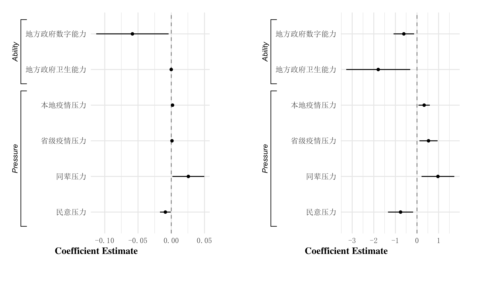

---
output:
  bookdown::pdf_document2:
    keep_tex: true
    fig_caption: true
    latex_engine: xelatex
    number_sections: true
  bookdown::word_document2:
    reference_docx: "template_CHN.docx"
    keep_md: true
    number_sections: FALSE
knit: (function(inputFile, encoding) {rmarkdown::render(inputFile, encoding = encoding, output_format = c("bookdown::word_document2", "bookdown::pdf_document2")) })
documentclass: ctexart

fontsize: 12pt
geometry: margin=1in
bibliography: Covid19Policy.bib
csl: "china-national-standard-gb-t-7714-2015-author-date.csl"
link-citations: true
colorlinks: true
toc: false
indent: true
always_allow_html: true

editor_options: 
  markdown: 
    wrap: sentence

title: '能力不够压力来凑：能力空间与压力型体制'
subtitle: "——基于2021年春节期间地方疫情防控政策的实证研究"

author:
- 孙宇飞^[清华大学政治学系博士生，研究方向为大数据政治学、身份政治和政治传播。联系电话：18638750921，邮箱：sunyf20@mails.tsinghua.edu.cn，通讯地址：北京市海淀区清华大学，邮编：100084]
- 杨雪冬^[本文通讯作者。清华大学社科学院政治学系教授，博士生导师。研究方向为地方治理、当代中国政治、比较政治理论、全球化等。]

abstract: |
  “压力型体制”作为对中国地方治理实践的理论描绘，得到了国内外学者的广泛关注和讨论。十八大以来，党和政府推动的一系列政治体制改革，深刻得改变了“压力型体制”的运行环境，“压力型体制”在保持生动的描述力和较强的解释力的同时，遇到“减压阀失灵”等理论困境和解释力不足等问题。本研究在梳理已有理论的基础上，结合政策扩散和地方治理能力等理论视角，以政策文本在中央-地方和不同地方的扩散和变化作为窗口，以2021年春节期间疫情防控政策在中国293个地级市的差异化制定为案例，通过自然语言处理和回归分析等方法对“压力型体制”进行了理论检验与补充。
  
  笔者发现，和原有“压力型体制”的理论一致，上级、同级政府和民众的压力对地方政府的政策加码程度均有显著影响。此外，地方政府的治理能力对“压力型体制”的运行有着明显的“减压阀”效应，这一减压阀的存在使得地方政府在多方的压力下还能保留一定的自主性空间。地方政府的治理能力强弱影响着地方自主性空间的大小，治理能力越强的地方政府的行政自主性就越大，从而能够较为灵活的处理多方压力和政策加码。具体来说，在控制其他变量的前提下，地方政府的数字治理能力和卫生能力对地方政府疫情防控政策加码程度有着显著的负向影响。在此基础上，笔者提出了提出压力型体制运行过程中地方政府“能力空间”的概念，从而实现了对“压力型体制”的理论检验与修正。

  
  **关键词**：压力型体制；政策扩散；能力空间；层层加码。

---

# 引言

近年来，作为国家治理的核心环节，地方治理受到了学者们的广泛关注。研究者主要从不同部门、不同层级政府间的关系和互动模式出发，讨论其对于地方政府行为和治理模式的影响。在政府间关系上，有学者提出了"蜂巢式结构" [@Shue1990]  和"M型结构" [@QianXu1993] 等概念来形容改革开放前的政府间关系。更多学者关注改革开放后的政府间关系，他们提出的"中国特色的财政联邦主义" [@MontinolaEtAl1995] 和压力型体制 [@RongJingBen1998] 等解释广受学界的讨论。其中，“压力型体制”作为对中国地方治理实践的理论描绘，得到了国内外学者的广泛关注和讨论。 它不仅生动的描述了中国地方治理的压力和动力，还由于其理论的全局性，能够对其他富有解释力的概念（诸如“目标责任制” [@Edin2003] 、“项目制” [@ChenJiaJian2013] 、“行政发包制” [@ZhouLiAn2014] ）进行较好地整合。

自中国共产党第十八次全国代表大会以来，党和政府推动了一系列重大的政治体制改革，学者们从最高权力的重新集中 [@Guo2020] 、行政权的重新分配 [@FengShiZheng2014] 、地方自主性的削弱 [@JingYueJin2018] 等角度描述这些变化。 @LiZhenEtAl2020 等学者用“强监督、弱激励、硬指标”形象的描绘了十八大以来政治氛围上的变化 [@Ahlers2019] 对中国地方治理的影响。

虽然对解释十八大以来的地方治理现象仍有很强的解释力，甚至已经被官方话语所接纳[@YangYan2018; @Schubert2020]，但后疫情时代地方治理的现实需求和国家治理能力和治理体系现代化等诸多变化都对重新全面和系统的审视“压力型体制”经典理论，寻找更多影响因素，增强理论的解释力提出了迫切的要求。因此，本研究在梳理已有理论的基础上，结合政策扩散和地方治理能力等新的理论视角，提出一个更具整体性的分析框架和“能力空间”的概念。在此基础上，笔者使用2021年春节期间中国各地级市的疫情防控政策作为案例，使用自然语言处理和回归分析等方法，对压力型体制下地方治理能力与压力传导机制的关系进行了实证检验。

# “压力型体制”的特征、贡献及其新变化

自20世纪90年代提出以来，压力型体制受到学界的广泛讨论，它试图从政府间关系的视角，为理解中国地方治理的实践和动力提出一个全局性的分析框架。它对“行政发包制”、“控制权”、“项目制”等富有解释力的经典理论具有较强的整合能力，但近年来政府间关系的巨大变化，也对“压力型体制”理论提出了与时俱进的新要求。本节笔者就在梳理压力型特征以及和其他经典理论联系的基础上，基于当下地方治理实践，提出新的思考。

## “压力型体制”的概念

所谓的“压力型体制”，指的是在中国政治体系中，党政体制下的地方政府为了某一政策目标或政治任务的达成而构建的一套“把行政命令与物质激励结合起来的机制组合” [@YangXueDong2018] 。它是由 @RongJingBen1998 等人在上世纪末基于对中国东中西部不同县市的（河南新密、江苏无锡和陕西咸阳）调研提出，并具有全国代表性，是对传统的动员体制在市场化、现代化背景下的变形 [@YangXueDong2012] 。

“压力型体制”是地方政府对国家现代化压力的反应，它不仅描绘了中国政治系统中的动态过程，也结合了历史因素、制度因素与个体层面因素 [@YangYan2018] 。“压力型体制”的核心在于“压力系数”，即地方政府的自主性空间由上级政府决定，中央政府能够通过“压力系数”的调节来动态调整地方治理的自主性空间。 [@Schubert2020]

## “压力型体制”的要素以及与其他理论的联系

“压力型体制”是在现代化和市场化压力下出现的 [@YangXueDong2018] ，它的运行包括“三要素”、“四来源”和“两减压”三个主要部分。

“三要素”是指数量化的任务分解机制、各部门共同参与的问题解决机制和物质化的多层次评价体系。 数量化的任务分解机制是指纵向的政府间关系，党政机构使用具体的指标对上级的任务进行量化分解后层层下派到下级，并对执行结果提出要求。由于地方的自主性，政策目标并非单纯由上级部门制定，而是上下级共同博弈的结果 [@ZhangWenCui2021] ；各部门共同参与的问题解决机制是指横向不同政府部门的关系，用党委领导和临时抽调等方式来进行任务安排；物质化的多层次评价体系是指在完成任务后对承担任务的个人或集体以多种方式进行正向的激励和负向的惩戒。

“四来源”是指地方政府压力在压力型体制下面临着包括上级、同级、民众和市场四个方面的压力来源。上级的压力会根据当时中央的工作重点和上级提供的资源配置方式在领域和强度上发生变化，但是下级完成任务时也因为自筹资源而有一定的“可谈判空间”；同级的压力是指本行政区的其他政府和其他地区的同级政府在资源和市场以及发展速度和水平上的竞争；来自民众的压力随着经济体制的变革和社会结构的变化而逐渐加强；在和市场相关的议题上，政府由于其经济角色和招商引资的政策目标，也受到来自市场的压力。

“两减压”是指“关系”和“统计”这两大压力型体制的减压阀，他们分别掌握在上下级手中，分别对应着地方治理的两个关键过程。“关系”对应的是目标设定，上级如果制定不合理的政策目标，不仅会对下级的积极性造成影响 [@ZhuGuangNanEtAl2012] ，还会使得政策执行和政策目标出现偏差 [@ZhouXueGuang2009]。因此，上下级会借助私人关系等非正式制度来进行博弈和设定目标。“统计”是指在考核完成结果时，上级会通过调整统计方法和口径来调节下级的“压力参数”。

“压力型体制”通过“三要素”的运行过程，生动得刻画了中国地方政府在四大压力来源和两个减压阀下的整体治理环境。着眼于中国地方治理的全局，“压力型体制”能够对一些富有解释力的概念进行较好地整合。“三要素”中数量化的任务分解机制和“控制权”理论中的目标设定权[@ZhouXueGuangLianHong2012]和目标责任制[@TsuiWang2004]等理论联系紧密；“工作组模式” [@LiZhen2014] 、“督查机制” [@ChenJiaJian2015] 和“激励分配权” [@ZhouXueGuangLianHong2012] 是“压力型体制”下物质化的多层次评价体系的具体表现；“行政发包制” [@ZhouLiAn2014a] 、“竞争锦标赛” [@ZhouFeiZhou2009] 等理论对“压力型体制”下地方政府压力来源的作用机制进行了有力地补充。上述经典理论和压力型体制一起构造出一幅中国地方政府治理的完整图景。

## “减压阀失灵？”：十八大以来政府间关系的新变化与“压力型体制”的挑战

十八大以来，党和政府推动了一系列重大的政治体制变革，从而深刻改变了压力型体制的运行环境。 @YangYan2018 认为这一改变包括优化之前“多且重叠”的评估方法，减少了“一票否决”等制度的运用等。具体来说，十八大以来的政治体制改革，对压力型体制运行的环境都产生了整体性影响。在数量化的任务分解机制上，上级政府及其各系统部门的精细化指标和管理削弱了下级政府的行政自由裁量权 [@FengShiZheng2014] ；中央政府检查验收权的强化，使得之前对绩效的验收，拓展成对执行过程中的具体程序和阶段性目标的检查。经济权、税收和招商引资权的上收以及人员报酬的固定化都改变的压力型体制原有的物质化的多层次评价体系 [@HuangXiaoChun2017; @LiZhenEtAl2020] 。

中国地方政府的压力来源也发生了变化，上级政府原来单纯经济增长的压力演化为目标多元化的治理竞赛 [@PengBoZhaoJi2019]; 数字政府的建设使得政府对民众压力的回应性有了更高的要求。[@MengTianGuangLiFeng2015] 。近年来的政治体制改革对于压力型体制最大的影响在于两个主要减压阀的失灵。系统垂直化管理、预算公开和阳光工资等领域的改革使得地方政府政策执行的过程、程序和阶段性目标也成为监控的内容 [@LiZhenEtAl2020] ，之前时紧时松的纪律和规划得以严格执行，“关系”等非正式制度减压阀的作用空间越来越少；统计权的控制、数字管理的下沉 [@WangYuLei2016] 、统计手段和技术的进步和统计方法的确定和透明使得统计这个减压阀对压力越来越难发挥调节作用。

面对这些治理过程中的变化，压力型体制虽然仍表现出生动的描述力和较强的解释力 [@YangYan2018]，但是面对新的制度环境和新的现象依旧存在解释力上的不足。例如，在上级政府更多的使用“一竿子捅到底”的方式来制定和执行政策时，各地面对的制度环境和治理过程是相似的，但为什么地方的政策执行细则却产生巨大的差异？[@ZhouLiAnEtAl2015; PengPaiXinWen2021]；在原有两大减压阀失灵的情况下，地方政府为什么仍保留一定程度的行政自主性？等等。这些挑战亟待新变量的识别来对原有理论进行有限和必要的修正。

## 政策扩散与“能力空间”

政策文本是观察“压力型体制”下地方治理过程中的重要窗口，政策文本在不同层级和区域政府之间传递过程中的扩散（包括增减、创新、变通等），展现了地方政府在“压力型体制”下“受压”、“承压”和“转压”的全过程。政策扩散(Political Diffusion)理论给我们识别新变量、完善“压力型体制”的经典理论提供了新的视角和有益的启发。

“政策扩散”(Political Diffusion)作为地方治理的重要议题，近年来受到诸多关注和讨论[@Gilardi2010], 学者们主要从政策扩散的行为者[@DolowitzMarsh1996]、内容[@KingdonStano1984]、方式和条件[@MostStarr1980]等方面展开讨论。“政策扩散”领域对行为者尤其是内部参与者的研究对我们理解“压力型体制”下的地方自主性提供了一定的借鉴。内部参与者作为政策扩散的主体行为者，其主观能动性对政策扩散发挥着重要影响[@DolowitzMarsh1996]。现有文献主要研究了其偏好、目标和能力[@HuberShipan2002; @ShipanVolden2006a]对政策扩散的影响。个人意见、选民结构和利益集团喜好等都会影响到内部参与者对政策扩散的偏好[@GrahamEtAl2013a]；赢取连任、取得合法性的政治目标和招商引资、提升绩效的政策目标共同驱使着内部行为者对政策扩散和政策创新的动力[@GrossbackEtAl2004]；最重要的是，选择偏好和实现目标的前提是内部行为者有足够的能力来进行政策创新和政策扩散。“立法专业性”[@HuberShipan2002]、“时间有限性”和“信息有限性”[@Weyland2005]共同影响着政策制定者的能力。

在“压力型体制”下地方治理过程中，政策文本再现了地方政府“受压”、“承压”和“转压”的全过程，中央政府通过政策文件的传达进行“施压”，用行政力量推动政策自上而下的扩散，同级政府在共同“承压”的同时，由于晋升和民意带来的政策和政治目标又会向其他同级政府“施压”，从而改变其政策文本，推动政策扩散。

如上文所述，“压力型体制”运行的制度环境发生巨大的变化。其中，最明显的就是地方政府的行政自主性被各方力量所削弱：上级政府从制定“目标责任制”的普遍化，数字治理的精准控制到全流程监督制度的不断完善，不仅使得正式制度层面的“压力系数”越来越大，还使得非正式制度和统计口径这两个减压阀逐渐失灵。这意味着地方政府作为政策扩散的内部行动者其目标和偏好都高度相似；互联网普及和数字政府建设使得民众有更多的意见反映渠道，民意压力自下而上挤压了地方政府的自主性空间。与此同时，自上而下的上级政府压力还会和自下而上的民意压力形成合力，进一步挤压地方政府的自主空间。

但是，与此同时，笔者发现，在相似的制度环境和压力过程下，虽然大多地方政府都采取加码加压的政策扩散方式来确保回应上级压力，确保政策目标的实现，但并非所有的地方政府都采取一样的政策加码加压策略，甚至面对同样的政策有完全不同的政策扩散策略。以当前各地方政府的核心任务“疫情防控”为例，面对同样的政策目标和上级压力，有些地方采用一刀切的政策，对疫情防控各项规定顶格制定、顶格执行，出现了“全城黄码”和将政策执行与民众福利和基本权利挂扣的乱相；有些地方则采用精准疫调的方式，实行精准防控，努力最早时间、最低层级、最小成本获得最大防控成效。

这种异质性一定程度上证明了地方政府在“强监督、弱激励和硬指标” [@LiZhenEtAl2020] 的政策过程中仍然具有一定的自主性空间；而不同地方政府自主性空间存在的较大差异一定程度上说明，这一调整自主性空间的“减压阀”由地方政府能动的控制。由此，笔者认为，这种自主性和之前的“压力系数”并不相同，它不是来源于上级政府，而是地方政府能动的结果。具体来说，这种新的减压阀来自于地方政府的治理能力。地方政府的治理能力使得他们在多方压力下还能保留一定的自主性空间，而这一自主性空间的大小是由地方政府的治理能力强弱决定的。笔者将这种由能力取得的自主性空间称之为的“能力空间”。下图是笔者对“能力空间”和压力型体制经典理论的图像化表述。

{width=100%}

# 实证检验：以2021年春节期间各地的疫情防控政策为例

下文中，笔者以2021年春节期间疫情防控政策在中国各地的差异化制定为案例，来剖析和验证地方政治治理能力对“压力型体制”运行的影响。疫情防控是2021年中国各地政府工作的核心任务。元旦和春节期间，由于人员流动性大，聚集性活动多，进口冷链食品和货物物流增大，做好“两节”期间新型冠状病毒的疫情防控工作是中国各地政府任务的重中之重。

春节期间疫情防控政策是考察“压力型体制”运行的典型案例：**首先，中心任务明确。**2021年春节期间，中国本土疫情呈零星散发和局部聚集性疫情交织叠加态势，防控形势严峻复杂。
国务院从2020年底就开始部署2021年元旦和春节期间的疫情防控工作[@GuoWuYuanLianFangLianKongJiZhiZongHeZu2020]，在中央政府的统一安排下，各地的政策目标十分明确，整个社会经济系统围绕当地党委政府的指挥棒运行，党政部门是既是指挥员，又是组织员和作战员 [@YangXueDong2021]；**其次，压力传输明显。**在国务院应对新型冠状病毒感染肺炎疫情联防联控机制综合组发布《关于做好2021年元旦和春节期间新冠肺炎疫情防控工作的通知》[@GuoWuYuanLianFangLianKongJiZhiZongHeZu2020]后，从中央到省再到地级市直至基层村（社区）行政管理部门都发布了有关“春节期间新型冠状病毒的疫情防控工作”的政策文本，逐级严格，压力传输明显；更为重要的是，虽然受到的压力相同，也都使用加码的方式来传输压力，但加码方式在不同层级、同一层级的不同地域的地方政府间存在较大的**异质性**。这种政策扩散的差异性表现给我们衡量“压力型体制”在不同层级和不同地域的运行逻辑和影响变量的识别提供了绝佳的机会窗口。

## 实证策略

具体来说，本文尝试回答两个研究问题：首先，虽然对个别地方政府的对春节疫情防控“层层加码”、“一刀切”的现象批评众多[@GuangMingRiBao2021]，但尚未有研究对这一现象的在全国范围内进行实证考察。中国不同层级和地域的地方政府在2021年春节期间疫情防控政策上是否都受到“压力型体制”的影响？具体表现为是否存在“层层加码”的现象？进一步的，如果这种基于“压力型体制”的层层加码现象是普遍的，不同地方政府的加码策略是否存在异质性？哪些因素影响着他们的政策加码程度？

笔者通过对2021年春节期间疫情防控政策在中国各地的差异化制定的分析，来考察“压力型体制”在不同层级和不同地域的运行逻辑和机制，在此基础上笔者还进一步识别了“压力型体制”的影响变量和压力来源。具体来说，笔者首先使用自然语言处理等方法对中国293个地级市2021年春节期间的疫情防控政策文本进行编码，再使用描述性统计的方式考察各地各层级的“层层加码”现象；之后借助回归分析对影响变量和压力来源进行识别和检验。

## 研究假设

据此，笔者提出本文的研究假设：

对于第一个研究问题，笔者提出研究假设1:

**H1:中国不同层级和地域的地方政府在2021年春节期间疫情防控政策上存在“层层加码”的现象；**

对于第二个研究问题，笔者提出研究假设2:

**H2: 地方政府的治理能力影响着当地的政策加码程度；**

具体来说，在地方国家能力变量的测量上，笔者选择了和疫情防控最为相关的数字政府治理能力和医疗能力：

**H2.1: 地方政府的数字治理能力越高，当地的政策加码程度越小；**

**H2.2: 地方政府的医疗能力越高，当地的政策加码程度越小。**

## 变量设置和数据来源

本研究的因变量是2021年春节期间疫情防控政策的加码程度，笔者对于因变量的处理分为两个部分：首先，笔者借助网络爬虫从政府网站、政府公众号和政务服务平台等数据源获取了全国293个地级市2021年春节期间的疫情防控政策。需要强调的是，笔者关注的是各地针对来自**低风险地区**前往**城市地区**人群的疫情管控政策。选择低风险地区是因为社会各界对来自**中高风险**人员的管制意见较为一致，均采用严格的措施围堵疫情，而在对于来自**低风险地区**的人员管制意见差异较大，因此在制定对**低风险地区**人员的疫情管制时，地方政府会面对更大更复杂的压力。这种多方压力下的异质性也更有利于我们对其政策扩散的机制进行考察；选择**城市地区**是因为中央政府明确规定了返回农村地区的防控政策^[请参见国家卫生健康委员会网页：http://www.nhc.gov.cn/jkj/dongt/202101/4378bd2dd76b4d9a8d995660e90fb4a6.shtml]，这一压力是顶格且一致的。地方政府的加码空间较少，而中央对城市地区的管控政策较为模糊，没有明确规定。

对于上述政策文本，笔者使用机器编码和人工查核相结合的方式对目标政策进行编码处理。我们首先使用正则表达式对政策文本的关键词进行识别从而进行初步分类；其次，研究团队的三位编码员在经过培训后对原始文本进行查核，对模糊和争议分类进行逐个确定，最终形成一致的分类结果。通过机器编码和人工查核，我们将目标政策分为“有条件自由流动”（1）、“健康报备”（2）、“核酸检测”（3）、“健康监测”（4）、“居家健康监测”（5）和“居家隔离”（6）六种类型。

本文的核心自变量是地方的治理能力，笔者主要关注和疫情防控相关的数字政府治理能力和医疗能力。笔者使用清华大学数据治理中心2021年发布的《中国数字政府发展研究报告》[@MengTianGuangZhangXiaoJing2021]中对中国主要城市政府的数字治理能力评估的指数。这一指数侧重于分析政府利用数字化平台提供公共服务、开展政民互动的能力。该测评设置平台管理、数据开放、政务服务、政民互动四项二级指标，分别衡量数字政府发展各类功能载体的健全性、便利性、安全性等特征。在地方政府的医疗量能上笔者使用的是该地级市的医院床位数，该数据和诸如该地的国民生产总值等控制变量均整理自各地的统计年鉴。

与此同时，本文的还考察了上级政府、同级政府和民众等压力来源对地方政府的压力。笔者使用地级市所在省份政策颁布前一个月（2020年12月）的新型冠状病毒确诊数量作为上级政府压力的代理变量。在同级政府方面，地方政府受到的压力不仅来自相同区域的同级政府，而是来自发展程度更加相似的同级地方政府[@ZhouLiAn2007]。因此，笔者将同级政府的压力分成两种情况，如果该地级市是副省级城市或省会城市，笔者使用同等级城市2020年12月新型冠状病毒确诊数量的平均值作为同级政府压力的代理变量；如果该地级市是一般的城市，笔者使用同省的其他城市2020年12月新型冠状病毒的确诊数量作为政府压力的代理变量。各地各层级2020年12月新型冠状病毒的确诊数量的数据来源均整理自当地卫健委。在民众压力的实证策略上，笔者使用关键词“疫情”的百度搜索指数在2020年12月的环比增长数量作为民众压力的代理变量。^[请参见百度指数网页：https://zhishu.baidu.com/]

## 不同层级、不同区域地方政府间的“层层加码”现象:经验证据

从下表中我们很容易看到，省级政府提出防控政策的严格程度平均说来都超过了中央提出的防疫政策，市级政府提出防控政策的严格程度平均说来都超过了省级政府提出的防疫政策，即从中央到地级市层级，2021年春节期间的防疫政策呈现出越向基层越严格的“层层加码”态势。

具体来说，省一级加码最多的是吉林省，要求所有“非中高风险地区返（来）吉人员须持3日内新冠病毒核酸检测阴性证明。”^[具体请参见请参见《关于加强春节期间返（来）吉人员管理与服务做好新冠肺炎疫情防控工作的通知》http://www.jl.gov.cn/zw/tzgg/gsgg/gg/202102/t20210201_7932090.html]。 市一级加码最多的是以山东德州为代表的地级市，这些地方政府要求从低风险地区返回的民众，进行14天居家健康监测。

<table class="table" style="margin-left: auto; margin-right: auto;">
<caption>Table 1: 中央、省和地级市疫情防控政策比较</caption>
 <thead>
<tr>
<th style="empty-cells: hide;border-bottom:hidden;" colspan="1"></th>
<th style="border-bottom:hidden;padding-bottom:0; padding-left:3px;padding-right:3px;text-align: center; " colspan="3">
省级防控政策
</th>
<th style="border-bottom:hidden;padding-bottom:0; padding-left:3px;padding-right:3px;text-align: center; " colspan="3">
市级防控政策
</th>
</tr>
  <tr>
   <th style="text-align:center;"> 中央防控政策 </th>
   <th style="text-align:center;"> 均值 </th>
   <th style="text-align:center;"> 最大值 </th>
   <th style="text-align:center;"> 最小值 </th>
   <th style="text-align:center;"> 均值. </th>
   <th style="text-align:center;"> 最大值. </th>
   <th style="text-align:center;"> 最小值. </th>
  </tr>
 </thead>
<tbody>
  <tr>
   <td style="text-align:center;"> 1 </td>
   <td style="text-align:center;"> 1.23 </td>
   <td style="text-align:center;"> 3 </td>
   <td style="text-align:center;"> 1 </td>
   <td style="text-align:center;"> 1.81 </td>
   <td style="text-align:center;"> 5 </td>
   <td style="text-align:center;"> 1 </td>
  </tr>
</tbody>
</table>

为了更加形象的展示不同地区在疫情防控政策上的加码情况，笔者在东、中、西和东北部各选取了一个省，具体地说，东部选取了浙江省，中部选取了河南省，西部选取了青海省，东北部选取了吉林省来详细比较他们的加码差异。

从下表数据笔者发现，在空间分布上，压力型体制仍旧是一个全国性的体制，防疫政策加码的情况在除浙江省外的中、西和东北广泛存在。而且和现有理论的发现一致，防疫政策加码的情况在空间存在上不平衡的特点 [@YangXueDong2012]。笔者还汇报了各省的省级数字治理能力指数，对比各省数字治理能力指数与疫情防控措施的加码程度可以发现，和经典理论不同的是，这种不平衡性似乎和是否处在经济起飞阶段并没有很强的相关性，而是和地方政府的数字治理能力更加相关。

<table class="table" style="margin-left: auto; margin-right: auto;">
<caption>Table 2: 东、中、西、东北地区个别省份疫情防控政策比较</caption>
 <thead>
  <tr>
   <th style="text-align:center;"> 省份 </th>
   <th style="text-align:center;"> 省级防控政策 </th>
   <th style="text-align:center;"> 市均值 </th>
   <th style="text-align:center;"> 市最大值 </th>
   <th style="text-align:center;"> 市最小值 </th>
   <th style="text-align:center;"> 省级数字治理能力指数 </th>
  </tr>
 </thead>
<tbody>
  <tr>
   <td style="text-align:center;"> 浙江 </td>
   <td style="text-align:center;"> 1 </td>
   <td style="text-align:center;"> 1.00 </td>
   <td style="text-align:center;"> 1 </td>
   <td style="text-align:center;"> 1 </td>
   <td style="text-align:center;"> 37.2 </td>
  </tr>
  <tr>
   <td style="text-align:center;"> 山西 </td>
   <td style="text-align:center;"> 1 </td>
   <td style="text-align:center;"> 2.23 </td>
   <td style="text-align:center;"> 5 </td>
   <td style="text-align:center;"> 1 </td>
   <td style="text-align:center;"> 25.3 </td>
  </tr>
  <tr>
   <td style="text-align:center;"> 青海 </td>
   <td style="text-align:center;"> 1 </td>
   <td style="text-align:center;"> 2.70 </td>
   <td style="text-align:center;"> 5 </td>
   <td style="text-align:center;"> 1 </td>
   <td style="text-align:center;"> 19.3 </td>
  </tr>
  <tr>
   <td style="text-align:center;"> 吉林 </td>
   <td style="text-align:center;"> 3 </td>
   <td style="text-align:center;"> 3.20 </td>
   <td style="text-align:center;"> 4 </td>
   <td style="text-align:center;"> 3 </td>
   <td style="text-align:center;"> 28.2 </td>
  </tr>
</tbody>
</table>

由此笔者验证了本文的第一个研究假设：中国不同层级和地域的地方政府在2021年春节期间疫情防控政策上存在“层层加码”的现象，在层级上，地级市政府加码最多，在空间上，数字治理能力弱的地区加码最多。

## “能力空间”：政府能力与加码程度的经验证据

笔者继续检验本文的第二个研究假设，即检验影响地方政府政策加码程度的原因，在检验经典理论的基础上，笔者着重识别和检验了地方政府的治理能力的影响。

{width=100%}

根据上图回归分析的结果，笔者发现，经典理论中的四个压力来源对地方政府疫情防控政策的加码程度仍有较强的解释力，本地疫情压力、同级政府压力、上级政府压力和民众压力对地方政府疫情防控政策的加码程度仍有显著影响：在控制其他变量的前提下，本地疫情越严重，地方政府疫情防控政策加码越多；和本地同级城市疫情越严重，地方政府疫情防控政策加码越多；本地所在省份疫情越严重，地方政府疫情防控政策加码越多；民众压力越大，地方政府疫情防控政策加码越少。

在此基础上，笔者识别和检验了地方政府的治理能力尤其是数字治理能力的影响，回归分析发现，地方政府的数字治理能力和卫生能力对地方政府疫情防控政策加码程度仍有显著影响：在控制其他变量的前提下，地方政府的数字治理能力越强，地方政府疫情防控政策加码越少；地方政府的卫生能力越强，地方政府疫情防控政策加码越少。即，治理能力是地方政府面对各方压力的减压阀，治理能力越强的地方政府的行政自主性即“能力空间”就越大，从而能够较为灵活的处理多方压力和政策加码。

在对变量进行标准化处理后，我们可以比较不同自变量对因变量的影响程度。通过上右图的比较，笔者发现，地方的治理能力尤其是卫生能力，在所有自变量中对地方政府疫情防控政策的加码程度影响最大；地方的数字治理能力对地方政府疫情防控政策的加码程度也有较大影响。

# 总结与讨论

近年来，作为国家治理的核心环节，地方治理受到学者广泛的关注。“压力型体制”作为对中国地方治理实践的理论描绘，得到了国内外学者的广泛关注和讨论，不仅生动的描述了中国地方治理的压力和动力，还能够对“目标责任制”、“项目制”和“行政发包制” 等一些富有解释力的概念进行较好地整合。

中国共产党第十八次全国代表大会以来，党和政府推动了一系列重大的政治体制改革，“强监督、弱激励、硬指标”的地方治理氛围，深刻得改变了压力型体制的运行环境。在这一改革进程中，“压力型体制”的表现更趋明显，甚至已经被官方话语所接纳。虽然压力型体制仍然表现出生动的描述力和较强的解释力，但是面对新的制度环境和新的现象依旧存在解释力上的不足。

本研究在梳理已有理论的基础上，结合政策扩散和地方治理能力等理论视角，提出压力型体制下“能力空间”的概念。笔者认为，地方政府的治理能力使得他们在各界压力下还能保留一定的自主性空间，而这一自主性空间的大小是由地方政府的治理能力的强弱决定的。

在此基础上，本研究以以2021年春节期间疫情防控政策在中国各地的差异化制定为案例，实证检验了地方政治治理能力对“压力型体制”运行的影响。通过实证分析，笔者发现，经典理论中的同级、上级和民众对地方政府的政策加码程度均有显著影响，其中同级和上级压力对政策加码程度有显著的正向影响，上级压力和同级压力越大，政策加码越多。而民众压力对有显著的负向影响，民众对疫情防控的关注越多，政策加码越少。在检验经典理论的基础上，笔者着重识别和检验了地方政府的治理能力尤其是数字治理能力和医疗量能的影响，笔者发现，地方政府的数字治理能力和卫生能力对地方政府疫情防控政策加码程度有明显的“减压阀”作用，治理能力越强的地方政府的行政自主性即“能力空间”就越大，从而能够较为灵活的处理多方压力和政策加码。

本文不仅利用实证数据和方法对“压力型体制”这一经典理论进行实证检验，发现在十八大之后的政治体制变革中，“压力型体制”对中国地方治理的实践仍然有较强的解释力；还发现地方政府治理能力对“压力型体制”运行的“减压阀”效应，提出了“能力空间”与“有自主性的压力型体制”的观点，对“压力型体制”在新时代进行了理论修正与检验。需要说明的是，本文也存在明显的不足：首先，由于数据的限制，笔者仅对加码行为进行了“中央-省-地级市”层面的分析，而对原有理论中“压力型体制表现得更加突出”的县级政府 [@YangXueDong2012] 本文并没有足够的数据来进行实证检验；其次，通过大样本的数据分析虽然能够在总体上发现相关性，但是在影响机制上的探索有限。地方政府治理能力对压力型体制下地方自主性的具体影响机制还有待后续研究进一步完善。

\newpage

# 参考文献

